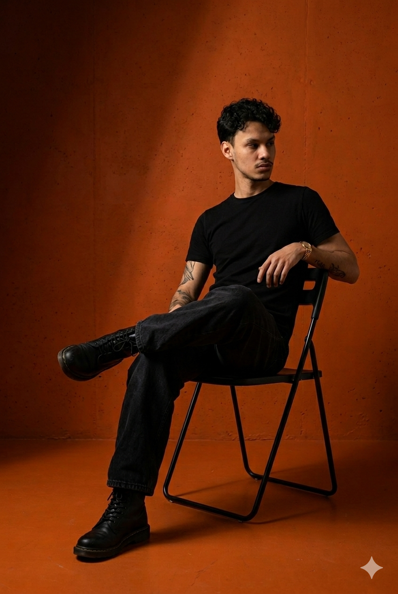

<table width="100%" border="0" cellspacing="0" cellpadding="0">
  <tr>
    <td width="38%" valign="bottom">
      
    </td>
    <td valign="middle" align="left" style="padding-left: 32px;">
      <h1></h1>
      <h3>AI Native · Full Stack · Motion-Forward</h3>
      <p>Building things at the intersection of<br/><strong>art and engineering</strong> — from Karachi.</p>
      <p>
        <a href="https://www.linkedin.com/in/mashhoodhussain"></a>
        <a href="https://github.com/mashdotdev"></a>
        <a href="https://www.upwork.com/freelancers/~016315b7449c2e0802"></a>
      </p>
      
      
    </td>
  </tr>
</table>

---

Hi 👋 I'm **Mashhood Hussain** — an AI Native Full Stack Developer who obsesses over craft, motion, and making intelligent systems feel *alive*. My work blends GSAP-powered interfaces with agentic AI and production-grade backends.

<details>
<summary><b>✦ more about me</b></summary>
<br/>

- 🧠 &nbsp; 9 years coding · 3 years full-stack · 6+ hackathons
- 🤖 &nbsp; Specialise in LLM integrations, agentic workflows, and AI-first UX
- 🎞️ &nbsp; Motion design philosophy: *animation communicates intent*
- 📐 &nbsp; Currently building: **Portfolio v2**
- 📖 &nbsp; Currently learning: **Cloud infrastructure · Go Lang**
- 📍 &nbsp; Based in Karachi — available globally, replies in 24h
- 🎓 &nbsp; A-Levels (Cambridge) + Cloud Native AI Engineering (GIAIC)

</details>

---

## 🔥 &nbsp; github stats

<table width="100%" border="0">
  <tr>
    <td width="60%" valign="top">
      
      <br/><br/>
      
    </td>
    <td width="40%" valign="top" align="center">
      
      <br/><br/>
      
    </td>
  </tr>
</table>

---

## 🚀 &nbsp; featured work

<table width="100%" border="0">
  <tr>
    <td width="50%" valign="top">
      <a href="https://finance-tracker-api-xi.vercel.app">
        
      </a>
    </td>
    <td width="50%" valign="top">
      <a href="https://physical-ai-and-humanoid-robotics-c-seven.vercel.app/intro">
        
      </a>
    </td>
  </tr>
  <tr>
    <td width="50%" valign="top">
      <a href="https://milk-landing-page.vercel.app/">
        
      </a>
    </td>
    <td width="50%" valign="top">
      <a href="https://hackathon-rep-zone.vercel.app/">
        
      </a>
    </td>
  </tr>
</table>

---

## ✦ &nbsp; now

```ts
const mash = {
  belief:    "Intelligence should feel alive",
  motion:    "Motion is meaning",
  craft:     "The best work is felt, not noticed",
  building:  "Portfolio v2",
  learning:  ["Cloud", "Go Lang"],
  available:  true,
}
```

---

## 🛠 &nbsp; stack

<p>
  
  
  
  
  
  
  
  
  
  
  
  
  
  
  
</p>

---

<div align="center">


*contributions eating themselves since 2016*

</div>
